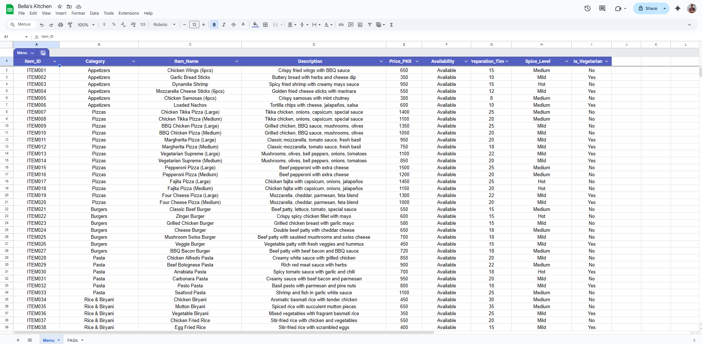

# 🍕 RestoBot – AI WhatsApp Ordering Agent (n8n + OpenAI + Automation)

> **AI-powered WhatsApp bot that takes restaurant orders like a human waiter — 24/7, no app needed!**

[](https://n8n.io)
[](https://openai.com)
[](https://airtable.com)
[](https://business.whatsapp.com)


---

## 🎯 What is RestoBot?

RestoBot is an intelligent WhatsApp chatbot that automates restaurant ordering end-to-end. Customers order naturally through WhatsApp, and the bot handles everything — from showing menus to verifying payments to tracking deliveries — just like a human waiter.

**No app downloads. No new platforms. Just WhatsApp.** 📱

---

## 💡 The Problem

### For Restaurant Owners:

* Staff shortage for order handling
* Missed calls during peak hours
* High operational costs
* Human errors in orders
* Limited working hours

### For Customers:

* Long wait times
* App fatigue
* Complex ordering experience
* Payment confusion

---

## ✅ The Solution

RestoBot automates the entire ordering process:

1. Greets customers naturally
2. Displays menu dynamically
3. Takes orders with variations
4. Builds cart with live total
5. Collects delivery details
6. Handles payments (COD / Online)
7. Verifies payment screenshots
8. Stores order in database
9. Tracks delivery status
10. Handles cancellations

---

## ✨ Key Features

### 🤖 Smart AI Chat

* Human-like conversation
* Context-aware replies
* Natural ordering experience

### 🛒 Cart System

* Add items dynamically
* Real-time cart updates
* Handles add-ons & variations

### 💳 Payment Verification

* Supports COD & Online payments
* Screenshot-based verification
* Fraud prevention logic

### 📊 Order Management

* Airtable database
* Order tracking & status updates
* Delivery confirmation system

### 📱 WhatsApp Integration

* No app needed
* Works directly on WhatsApp
* Real-time messaging

---

## 🔄 How It Works

```
User → WhatsApp Message
     ↓
Bot → Menu Display
     ↓
User → Select Items
     ↓
Bot → Cart + Total
     ↓
User → Confirm Order
     ↓
Bot → Payment & Details
     ↓
Order Stored → Confirmation Sent
```

---

## 🛠️ Tech Stack

* **n8n** – Workflow Automation
* **OpenAI GPT-4o-mini** – AI Responses
* **Airtable** – Database
* **WhatsApp Business API** – Communication
* **Google Sheets** – Menu Management

---

## 🧠 Skills Demonstrated

* AI Agent Development
* Workflow Automation (n8n)
* API Integration
* Prompt Engineering
* Database Design
* Real-world Problem Solving

---

## 📸 Screenshots




---

## 🎥 Demo

> (Add your Loom / YouTube link here)

---

## 💰 Benefits

### For Business:

* Reduce staff cost
* Handle unlimited orders
* 24/7 availability
* Zero human errors

### For Customers:

* Easy ordering via WhatsApp
* No app download
* Clear pricing
* Flexible payments

---

## 🎯 Use Cases

* Pizza shops 🍕
* Cafes ☕
* Cloud kitchens 🍜
* Home food businesses 🏠
* Delivery services 🚚

---

## 🔒 Note

Due to business constraints, full workflow files are not publicly available.

This repository demonstrates:

* System architecture
* Features & capabilities
* Real-world implementation

For demo access, feel free to contact me.

---

## 📞 Contact

**Om Pandey**

📧 Email: [ompandey.co@gmail.com](mailto:ompandey.co@gmail.com)
📱 WhatsApp: +91 7380207025
💼 LinkedIn: https://linkedin.com/in/ompandeyin
🔗 GitHub: https://github.com/ompandeyin

---

## 🙌 Acknowledgments

* n8n
* OpenAI
* Airtable
* WhatsApp Business API
* Google Sheets

---

## ⭐ If you like this project

Give it a ⭐ on GitHub and connect with me!

---

**Made with ❤️ in India**
