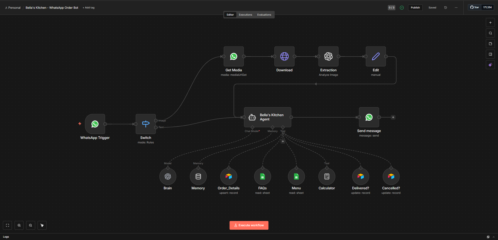
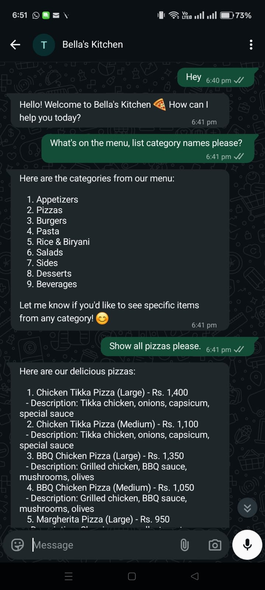
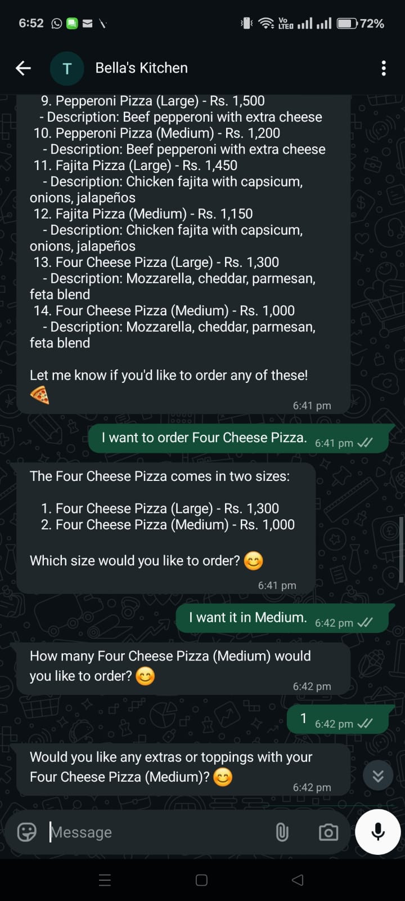
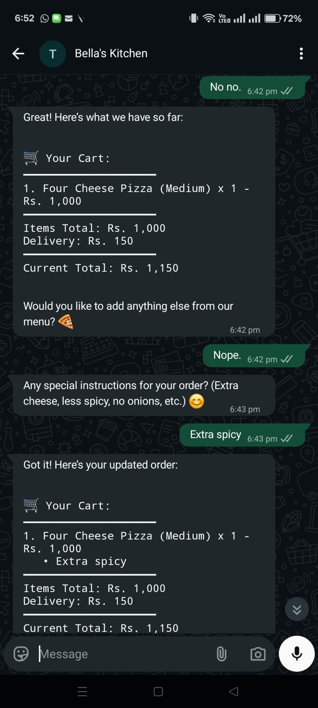
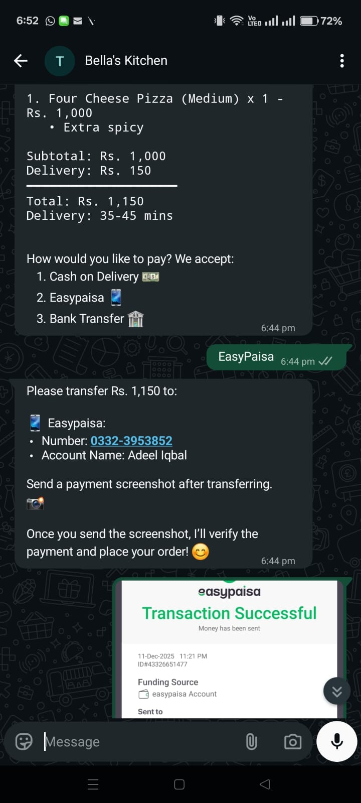
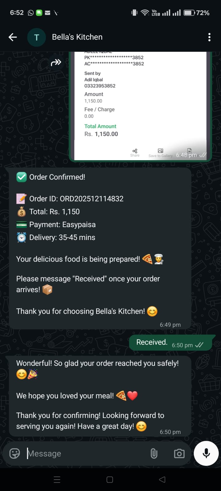

# 🍕 RestoBot – AI WhatsApp Ordering Agent

### ⚡ Automating Restaurant Orders using n8n + OpenAI + WhatsApp API

<p align="center">
  <b>Order food directly on WhatsApp — powered by AI, automation, and real-time workflows.</b>
</p>

<p align="center">
  
  
  
  
</p>

---

## 🚀 Overview

**RestoBot** is a fully automated AI-powered WhatsApp ordering system that replicates a human waiter experience.

Customers can:

* Browse menu 📋
* Place orders 🍔
* Customize items 🎯
* Make payments 💳
* Track delivery 🚚

👉 All inside WhatsApp — no app required.

---

## 🎯 Problem Statement

### 🍽️ Restaurant Challenges

* Missed orders during peak hours
* Staff dependency & high cost
* Manual errors in orders
* Limited availability

### 👤 Customer Pain Points

* Waiting on calls
* Installing multiple apps
* Confusing ordering experience

---

## 💡 Solution

RestoBot replaces manual order-taking with an **AI-driven automated workflow**:

```
Customer → WhatsApp Chat  
        ↓
AI Bot → Menu + Interaction  
        ↓
Cart → Order → Payment  
        ↓
Database → Confirmation → Delivery Tracking  
```

---

## 🧠 Core Features

### 🤖 Conversational AI Engine

* Human-like interaction
* Context-aware responses
* Smart follow-ups

### 🛒 Dynamic Cart System

* Add/remove items
* Real-time price updates
* Supports variations & add-ons

### 💳 Smart Payment Verification

* COD + Online Payment
* Screenshot validation using AI
* Fraud detection logic

### 📊 Order Management System

* Airtable database integration
* Status tracking (Pending → Delivered)
* Customer data storage

### 📱 WhatsApp Automation

* Real-time messaging
* Image handling
* Persistent chat context

---

## 🏗️ System Architecture



---

## 📸 Project Preview

<p align="center">
  
  
  
</p>

<p align="center">
  
  
  
</p>

---

## 🛠️ Tech Stack

| Category      | Technology            |
| ------------- | --------------------- |
| Automation    | n8n                   |
| AI Model      | OpenAI GPT-4o-mini    |
| Database      | Airtable              |
| Messaging API | WhatsApp Business API |
| Data Handling | Google Sheets         |

---

## 🧠 Skills Demonstrated

* AI Agent Development
* Workflow Automation
* API Integration
* Prompt Engineering
* Backend Logic Design
* Real-world Problem Solving

---

## 🎥 Demo

> 🚀 Coming Soon (or add your Loom link here)

---

## 📈 Business Impact

### 💼 For Businesses

* Reduce operational cost
* Handle unlimited orders
* 24/7 availability
* Zero manual errors

### 👤 For Customers

* Fast & simple ordering
* No app installation
* Flexible payment options
* Clear communication

---

## 🔒 Note

This project showcases a real-world automation system.

Due to business constraints:

* Full workflow files are not public
* Demo access available on request

---

## 📞 Contact

**Om Pandey**

📧 [ompandey.co@gmail.com](mailto:ompandey.co@gmail.com)
📱 +91 7380207025
💼 https://linkedin.com/in/ompandeyin
🔗 https://github.com/ompandeyin

---

## ⭐ Support

If you found this project useful:

👉 Star this repository
👉 Connect with me on LinkedIn

---

<p align="center">
  <b>🚀 Building AI Automation Solutions for Real-World Problems</b>
</p>
